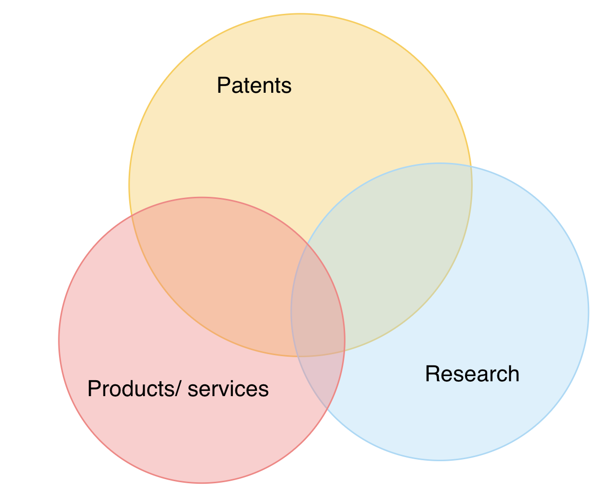
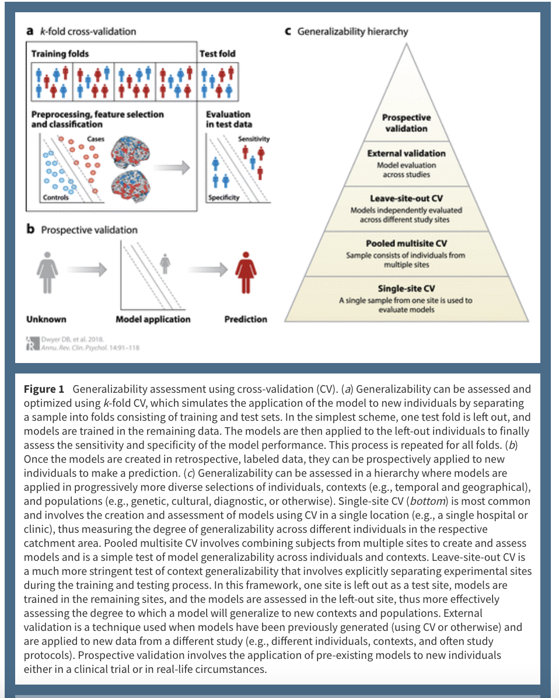

```{r setup, include = FALSE}
library("papaja")
library(googledrive)
r_refs("r-references.bib")
```

```{r analysis-preferences}
# Seed for random number generation
set.seed(42)
knitr::opts_chunk$set(cache.extra = knitr::rand_seed)
```

## Introduction 

[INSERT: Explanation AI]

Mental healthcare has been slower to adopt AI technology than physical healthcare [@miller_brown18, @jiang_etal17]. 
Still, the number of AI-powered mental health applications has been rising over the past years [@vaidyam_etal19, @miller_polson19, @nahavandi_etal22]. 
Similar to physical health applications, there exists a gap between the AI algorithms and tools developed and tested in research and the available products ready to be used by patients and healthcare practitioners [see @vanleeuwen_etal21]. 
Specifically, despite the indications of benefits associated with integrating AI into mental healthcare to enhance diagnosis, treatment, and clinical administration quality [@shatte_etal19], most of the tools and algorithms developed and tested in research have not (yet) made it into production [@lee_etal21, @sendak_etal20, @chekroud_etal21]. 
In fact, "no FDA-approved or FDA-cleared AI applications currently exist in psychiatry" [@lee_etal21, p. 5]. 
The lack of available products mainly concerns diagnostic and recommendation tools aiming at detecting psychological disorders and suggesting clinical treatment approaches (e.g., psychopharmacotherapy versus psychotherapy) [@chekroud_etal21]. 
In their scoping review of machine learning in psychotherapy research, @aafjes-vandoorn_etal21 identified 51 studies that developed and tested a machine learning algorithm aiming to classify or predict treatment process or outcome data or identify clusters in the patient or treatment data.
The authors conclude that current applications of machine learning in psychotherapy research provide a range of benefits for choosing appropriate treatment regimes, predicting treatment adherence, supporting therapist skill development, and predicting treatment response.
@shatte_etal19 identified 190 mental health tools aiming to detect and diagnose mental health conditions, 67 focused on prognosis, treatment and support, 26 on public health applications, and 17 on research and clinical administration.
These research findings do not align with the scope of marketed AI-based mental health products. 
While the focus of mental health AI research lies on developing tools that may detect and diagnose mental health conditions, the market is dominated by treatment, psycho-educational, and monitoring applications, such as chatbots, virtual agents, and sensor-data-based stress reduction applications [@larsen_etal19].
The main reasons for the lack of implementation into clinical practice include patient data confidentiality issues, explainability versus performance trade-offs, and the frequency of erroneous predictions (e.g., among underrepresented groups) [@roth_etal21, @chen_etal22, @sendak_etal20, @kelly_etal19, @chekroud_etal21, @aafjes-vandoorn_etal21]. 
In addition, mental health interventions often rely on the relational bond formed with the patient and the direct observation of patient behaviors and emotions, thus being hesitant to rely on AI recommendations [@shatte_etal19].  \\

Despite the public attention devoted to the risks and potential benefits of AI-based mental health applications [MAYBE SOME NEWS ARTICLES], an overview of available AI-supported mental health products is currently lacking.
In addition, we lack insight into the gap between research findings on AI-based mental health tools and marketed products in the field. 
Such an insight may provide a starting point for a systematic reduction of implementation barriers on the side of health care practitioners, application developers, and the general public, including patients suffering from mental health conditions. 
The current systematic review proceeds in two steps to answer these questions.
First, we provide an overview of available AI-powered mental health products. 
Herein, we include products developed for the general public, patients, and mental health practitioners. 
We will search [BRIEFLY DESCRIBE SEARCH STRATEGY]...
Second, we will compare the available products with the current state of AI-based research in detection and diagnosis, prognosis, treatment and support, public health applications, and clinical administration [@shatte_etal19]. \\




## Inclusion criteria
- "In Europe, the CE mark is a prerequisite for medical devices to be allowed on the market; therefore, CE marking of the product by April 2020 was a requirement for inclusion" [@vanleeuwen_etal21]
  - CE mark not relevant for mental health applications? 
  - Alternatives?
    - Trusted Apps (TUV) https://it-tuv.com/leistungen/zertifizierungen/zertifizierung-von-apps-trusted-app/#:~:text=Mit%20dem%20%E2%80%9ETrusted%20App%E2%80%9C%2D,sowie%20T%C3%9CV%2Deigene%20Best%20Practices.
- "Also, the product had to be vendor neutral and aid the radiologist in image interpretation in clinical practice."
  - vendor neutral?
  - aid the mental health practitioner in:
    - a) prognosis
    - b) detection/ diagnosis
    - c) treatment selection 
    - d) treatment 
    - e) predicting treatment outcome
    - f)skill development 
- "To perform a balanced evaluation, we considered suite components as separate products" [@vanleeuwen_etal21]

## Procedure

### Collect information on AI Mental Health Products

- "All vendors were contacted to verify the collected information and supplement the product specifications" [@vanleeuwen_etal21]
- "We retrieved information about the organ-based subspeciality, modality, and main task of the product. Also, the date to market, method of deployment, and pricing model were gathered." [@vanleeuwen_etal21]
  - determine product main task 
  - date to market 
  - method of deployment
  - pricing model 
- "The CE status was verified by collecting the CE certificates or Declaration of Conformity of the vendors; a public database does not exist yet (EUDAMED is planned for 2021)" [@vanleeuwen_etal21]
  - CE status (through EUDAMED)
- Also, the American FDA (Food and Drug Administration) approval status was gathered and confirmed with the public FDA database
  - FDA approval status


### Collect information on scientific evidence for effectiveness

- "PubMed was systematically searched by vendor and product name for peer-reviewed articles published between Jan 1, 2015, and May 18, 2020" 
  - search PubMed with relevant search term/ vendor names
- Secondly, a manual search was performed by inspecting the vendor’s websites for listings of papers and requesting vendors to provide peer-reviewed papers. No date restriction was applied for the manual search.
  - search vendor websites 
- Inclusion criteria for scientific evidence articles:
  - original
  - peer-reviewed
  - in English
  - aimed to demonstrate the efficacy of the AI software
  - product name (including known former names) and/or company name were mentioned
  - the tool was applied on in vivo human data
  - efficacy of the product was reported on an independent dataset (data on which the algorithm was not trained) 
  - Letters, commentaries, reviews, study protocols, white papers, and case reports were excluded
- Information collected: "For each article, we reviewed the author list, funding source, and disclosures to categorize the publication as vendor independent or not. Data used in the included papers was categorized for the number of centers, countries, and acquisition machine manufacturers it originated from. We aggregated this information per product to give insights in the total number of centers, countries, and manufacturers addressed in the total evidence of that product."
  - authors
  - funding source 
  - publication - vendor independent or not 
  - number of centers, countries, and device manufacturers it originated from 

## Validation types

{height=60%}

## Examples of successful implementation

@cecula_etal21: For example, Chekroud et al. (2016) conducted a pattern recognition study in a sample of 1,949 individuals within a clinical trial (Star-D) (Rush et al. 2006) of citalopram. Using a pipeline consisting of k-fold CV with elastic net regression, they detected a parsimonious predictive pattern of 25 clinical questionnaire items from a total of 164 patient-reportable variables. These variables predicted clinical remission at a rate of 65%, which was more than 30% above the base rate of predicted efficacy for the drug. The generalizability of the models was further demonstrated by their ability to predict remission in a completely different sample, and the validity of the models was highlighted by their specificity when they did not generalize to other pharmaceutical treatments. Notably, the high generalizability of the predictions, together with further research (Chekroud et al. 2017), facilitated the rapid translation of the models into a web-based application designed to provide decision support to primary health care providers and clients (https://www.springhealth.com). This machine learning service is now being prospectively trialed in hospital settings, thus further highlighting the possibility of direct research translation.

## Questions 

- How to find products?
  - exhibitor lists [@vanleeuwen_etal21]
  - marketplace offerings [@vanleeuwen_etal21]
  - monitoring news sources [@vanleeuwen_etal21]
- Narrow down focus? - depression and anxiety? Only patients or general public? 


\newpage

# References

::: {#refs custom-style="Bibliography"}
:::
